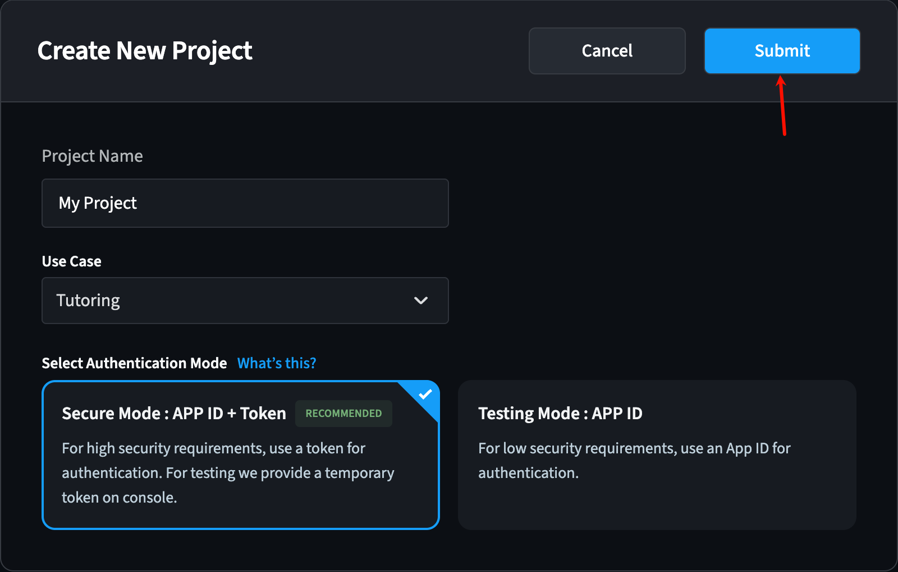
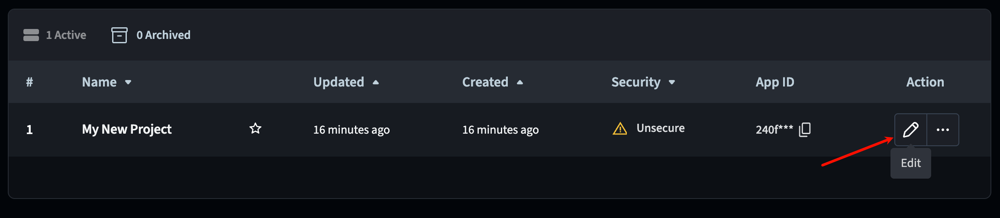
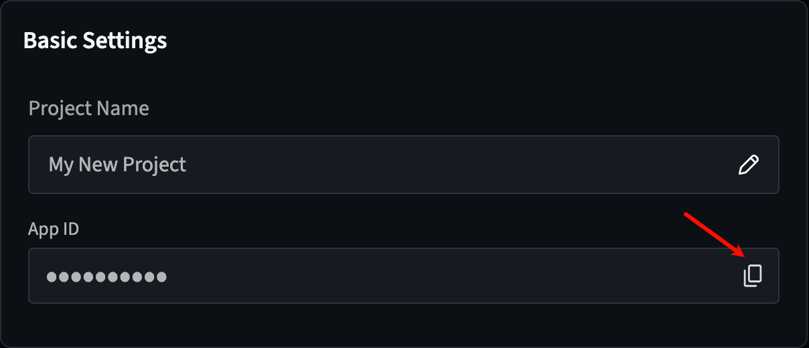

# Cloud Transcoding Service

English | [简体中文](./README_ZH.md)

## Service Introduction

Agora's Cloud Transcoding Service is developed specifically for live streaming scenarios in real-time interactive products. This service allows you to retrieve the host's audio and video source streams from an RTC channel on the server side, process them through transcoding, audio mixing, compositing, and other audio-video operations, and finally publish the processed streams to Agora's RTC channels for audience subscription. By using the Cloud Transcoding Service, viewers do not need to subscribe to multiple hosts' audio and video streams, thereby reducing downlink bandwidth pressure and performance consumption on client devices.

## Environment Preparation

- Obtain Agora App ID -------- [Agora Console](https://console.agora.io/v2)

  > - Click Create Application
  >
  >   
  >
  > - Select the type of application you want to create
  >
  >   

- Obtain App Certificate ----- [Agora Console](https://console.agora.io/v2)

  > In the project management page of the Agora Console, find your project and click Configure.
  > 
  > Click the copy icon under Primary Certificate to obtain the App Certificate for your project.
  > 

- Enable Cloud Transcoding Service
Please contact [Agora Technical Support](https://docportal.shengwang.cn/cn/Agora%20Platform/ticket?platform=Android&_gl=1%2a19d2qxx%2a_gcl_au%2aMTg0ODkxMDM3My4xNzIwNTExNDM3%2a_ga%2aMTI2ODMxNDY2OC4xNjg0MjkxODI0%2a_ga_BFVGG7E02W%2aMTcyMDUxMTIyMC4zMDIuMS4xNzIwNTExNjA0LjAuMC4w)

## API Call Examples

### Acquire Cloud Transcoding Resources
>
> Before creating a cloud transcoding task, you need to call the acquire method to obtain a tokenName. A builderToken can only be used for one cloud transcoding task.

Parameters that need to be set:

- appId: Agora project AppID
- username: Agora Basic Auth authentication username
- password: Agora Basic Auth authentication password
- instanceId: User-specified instance ID

Implement acquiring cloud transcoding resources by calling the `Acquire` method

```go
	ctx := context.Background()
    appId := "xxxx"
    username := "xxxx"
    password := "xxxx"
    credential := auth.NewBasicAuthCredential(username, password)
    config := &agora.Config{
        AppID:      appId,
        Credential: credential,
        DomainArea: domain.CN,
        Logger:     agoraLogger.NewDefaultLogger(agoraLogger.DebugLevel),
}

	cloudTranscoderClient, err := cloudtranscoder.NewClient(config)
	if err != nil {
		log.Fatalln(err)
	}
    
    acquireResp, err := cloudTranscoderClient.Acquire(ctx, &cloudTranscoderAPI.AcquireReqBody{
        InstanceId: instanceId,
    })
    if err != nil {
        log.Fatalln(err)
    }
	if acquireResp.IsSuccess() {
        log.Printf("acquire success:%+v\n", acquireResp)
	} else {
        log.Fatalf("acquire failed:%+v\n", acquireResp)
    }
```

### Start Cloud Transcoding
>
> After acquiring cloud transcoding resources through the acquire method, call the create method to start cloud transcoding.

Parameters that need to be set:

- builderToken: The tokenName obtained through the acquire method
- For more parameters in the request body, see the [Create](https://doc.shengwang.cn/doc/cloud-transcoder/restful/cloud-transcoder/operations/post-v1-projects-appId-rtsc-cloud-transcoder-tasks) API documentation

Implement creating cloud transcoding by calling the `Create` method

```go
 createResp, err := cloudTranscoderClient.Create(ctx, tokenName, &cloudTranscoderAPI.CreateReqBody{
  Services: &cloudTranscoderAPI.CreateReqServices{
   CloudTranscoder: &cloudTranscoderAPI.CloudTranscoderPayload{
    ServiceType: "cloudTranscoderV2",
    Config: &cloudTranscoderAPI.CloudTranscoderConfig{
     Transcoder: &cloudTranscoderAPI.CloudTranscoderConfigPayload{
      IdleTimeout: 300,
      AudioInputs: []cloudTranscoderAPI.CloudTranscoderAudioInput{
       {
        Rtc: &cloudTranscoderAPI.CloudTranscoderRtc{
         RtcChannel: "test-abc",
         RtcUID:     123,
         RtcToken:   "xxxxxx",
        },
       },
      },
      Outputs: []cloudTranscoderAPI.CloudTranscoderOutput{
       {
        Rtc: &cloudTranscoderAPI.CloudTranscoderRtc{
         RtcChannel: "test-efg",
         RtcUID:     456,
         RtcToken:   "xxxxx",
        },
        AudioOption: &cloudTranscoderAPI.CloudTranscoderOutputAudioOption{
         ProfileType: "AUDIO_PROFILE_MUSIC_STANDARD",
        },
       },
      },
     },
    },
   },
  },
 })
 if err != nil {
  log.Fatalln(err)
 }

 if createResp.IsSuccess() {
  log.Printf("create success:%+v\n", createResp)
 } else {
  log.Printf("create failed:%+v\n", createResp)
  return
 }
```

### Query Cloud Transcoding
>
> After starting cloud transcoding, you can call the query method to check the cloud transcoding status.

Parameters that need to be set:

- taskId: The taskId obtained from the Create method
- builderToken: The tokenName obtained through the acquire method

Implement querying cloud transcoding status by calling the `Query` method:

```go
  queryResp, err := cloudTranscoderClient.Query(ctx, taskId, tokenName)
  if err != nil {
   log.Println(err)
   return
  }

  if queryResp.IsSuccess() {
   log.Printf("query success:%+v\n", queryResp)
  } else {
   log.Printf("query failed:%+v\n", queryResp)
   return
  }
```

### Update Cloud Transcoding
>
> After starting cloud transcoding, you can call the update method to update the cloud transcoding status.

Parameters that need to be set:

- taskId: The taskId obtained from the Create method
- builderToken: The tokenName obtained through the acquire method
- sequenceId: The sequence number of the Update request. The value must be greater than or equal to 0. Ensure that the sequence number of a subsequent Update request is greater than that of the previous Update request. The sequence number ensures that the Agora server updates the cloud transcoder according to your latest specified configuration.

- For more parameters in the request body, see the [Update](https://doc.shengwang.cn/doc/cloud-transcoder/restful/cloud-transcoder/operations/patch-v1-projects-appId-rtsc-cloud-transcoder-tasks-taskId) API documentation

Implement updating cloud transcoding by calling the `Update` method

```go
 updateResp, err := cloudTranscoderClient.Update(ctx, taskId, tokenName, 1, &cloudTranscoderAPI.UpdateReqBody{
  Services: &cloudTranscoderAPI.CreateReqServices{
   CloudTranscoder: &cloudTranscoderAPI.CloudTranscoderPayload{
    ServiceType: "cloudTranscoderV2",
    Config: &cloudTranscoderAPI.CloudTranscoderConfig{
     Transcoder: &cloudTranscoderAPI.CloudTranscoderConfigPayload{
      IdleTimeout: 300,
      AudioInputs: []cloudTranscoderAPI.CloudTranscoderAudioInput{
       {
        Rtc: &cloudTranscoderAPI.CloudTranscoderRtc{
         RtcChannel: "test-abc",
         RtcUID:     123,
         RtcToken:   "xxxxxx",
        },
       },
      },
      Outputs: []cloudTranscoderAPI.CloudTranscoderOutput{
       {
        Rtc: &cloudTranscoderAPI.CloudTranscoderRtc{
         RtcChannel: "test-efg",
         RtcUID:     456,
         RtcToken:   "xxxxx",
        },
        AudioOption: &cloudTranscoderAPI.CloudTranscoderOutputAudioOption{
         ProfileType: "AUDIO_PROFILE_MUSIC_HIGH_QUALITY_STEREO",
        },
       },
      },
     },
    },
   },
  },
 })
 if err != nil {
  log.Println(err)
  return
 }

 if updateResp.IsSuccess() {
  log.Printf("update success:%+v\n", updateResp)
 } else {
  log.Printf("update failed:%+v\n", updateResp)
  return
 }
```

### Stop Cloud Transcoding
>
> If you no longer need cloud transcoding, you can initiate a Delete request to destroy it.

Parameters that need to be set:

- taskId: The taskId obtained from the Create method
- builderToken: The tokenName obtained through the acquire method

Implement stopping cloud transcoding by calling the `Delete` method

```go
  deleteResp, err := cloudTranscoderClient.Delete(ctx, taskId, tokenName)
  if err != nil {
   log.Println(err)
   return
  }
  if deleteResp.IsSuccess() {
   log.Printf("delete success:%+v\n", deleteResp)
  } else {
   log.Printf("delete failed:%+v\n", deleteResp)
   return
  }
```

## Error Codes and Response Status Codes

For specific business response codes, please refer to the [Response Status Codes](https://doc.shengwang.cn/doc/cloud-transcoder/restful/response-code) documentation
