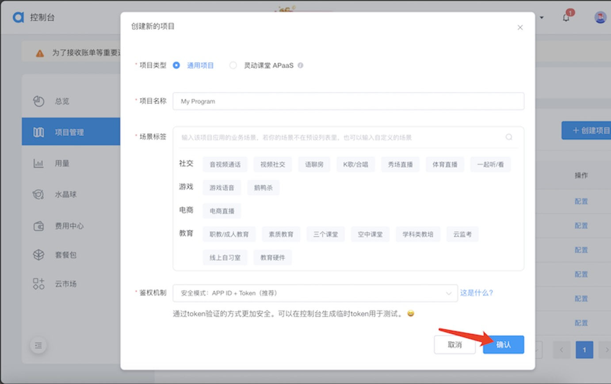
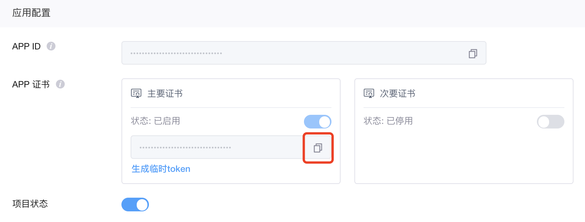

# 对话式 AI 引擎服务

 [English](./README.md) | 简体中文

## 服务概述

声网对话式 AI 引擎重新定义了人机交互界面，突破了传统文字交互，实现了高拟真、自然流畅的实时语音对话，让 AI 真正“开口说话”。适用于智能助手、情感陪伴、口语陪练、智能客服、智能硬件、沉浸式游戏 NPC 等创新场景。

## 环境准备

- 获取声网App ID -------- [声网Agora - 文档中心 - 如何获取 App ID](https://docs.agora.io/cn/Agora%20Platform/get_appid_token?platform=All%20Platforms#%E8%8E%B7%E5%8F%96-app-id)

  > - 点击创建应用
  >
  >   
  >
  > - 选择你要创建的应用类型
  >
  >   

- 获取App 证书 ----- [声网Agora - 文档中心 - 获取 App 证书](https://docs.agora.io/cn/Agora%20Platform/get_appid_token?platform=All%20Platforms#%E8%8E%B7%E5%8F%96-app-%E8%AF%81%E4%B9%A6)

  > 在声网控制台的项目管理页面，找到你的项目，点击配置。
  > 
  > 点击主要证书下面的复制图标，即可获取项目的 App 证书。
  > 

- 启用会话式AI引擎服务 ----- [启用服务](https://doc.shengwang.cn/doc/convoai/restful/get-started/enable-service)
  > 

## API定义

更多API详情，请参考 [API文档](https://doc.shengwang.cn/api-ref/convoai/go/go-api/overview)

## API调用示例

### 初始化会话式AI引擎客户端

```go
    const (
        appId                 = "<your appId>"
        cname                 = "<your cname>"
        username              = "<the username of basic auth credential>"
        password              = "<the password of basic auth credential>"
	)   
	// Initialize Conversational AI Config
	config := &convoai.Config{
		AppID:      appId,
		Credential: auth.NewBasicAuthCredential(username, password),
		// Specify the region where the server is located. Options include CN, EU, AP, US.
		// The client will automatically switch to use the best domain based on the configured region.
		DomainArea: domain.CN,
		// Specify the log output level. Options include DebugLevel, InfoLevel, WarningLevel, ErrLevel.
		// To disable log output, set logger to DiscardLogger.
		Logger: agoraLogger.NewDefaultLogger(agoraLogger.DebugLevel),
		// Specify the service region. Options include ChineseMainlandServiceRegion, GlobalServiceRegion.
		// ChineseMainlandServiceRegion and GlobalServiceRegion are two different services.
		ServiceRegion: convoai.ChineseMainlandServiceRegion,
	}

	// Initialize the Conversational AI service client
	convoaiClient, err := convoai.NewClient(config)
	if err != nil {
		log.Fatalln(err)
	}
```

### 创建对话式智能体
>
> 创建对话式 AI 智能体实例并加入RTC频道。

需要设置的参数：LLM、TTS和代理相关参数。

调用`Join`方法创建会话代理，以使用字节跳动TTS为例：

```go
    const (
        cname                 = "<your cname>"
        agentRtcUid           = "<your agent rtc uid>"
        username              = "<the username of basic auth credential>"
        password              = "<the password of basic auth credential>"
        agentRtcToken         = "<your agent rtc token>"
        llmURL                = "<your LLM URL>"
        llmAPIKey             = "<your LLM API Key>"
        llmModel              = "<your LLM model>"
        ttsBytedanceToken     = "<your bytedance tts token>"
        ttsBytedanceAppId     = "<your bytedance tts app id>"
        ttsBytedanceCluster   = "<your bytedance tts cluster>"
        ttsBytedanceVoiceType = "<your bytedance tts voice type>"
    )
	name := appId + ":" + cname

	// Start agent
	joinResp, err := convoaiClient.Join(ctx, name, &req.JoinPropertiesReqBody{
		Token:           agentRtcToken,
		Channel:         cname,
		AgentRtcUId:     agentRtcUid,
		RemoteRtcUIds:   []string{"*"},
		EnableStringUId: agoraUtils.Ptr(false),
		IdleTimeout:     agoraUtils.Ptr(120),
		LLM: &req.JoinPropertiesCustomLLMBody{
			Url:    llmURL,
			APIKey: llmAPIKey,
			SystemMessages: []map[string]any{
				{
					"role":    "system",
					"content": "You are a helpful chatbot.",
				},
			},
			Params: map[string]any{
				"model":      llmModel,
				"max_tokens": 1024,
			},
			MaxHistory:      agoraUtils.Ptr(30),
			GreetingMessage: "Hello, how can I help you?",
		},
		TTS: &req.JoinPropertiesTTSBody{
			Vendor: req.BytedanceTTSVendor,
			Params: &req.TTSBytedanceVendorParams{
				Token:       ttsBytedanceToken,
				AppId:       ttsBytedanceAppId,
				Cluster:     ttsBytedanceCluster,
				VoiceType:   ttsBytedanceVoiceType,
				SpeedRatio:  1.0,
				VolumeRatio: 1.0,
				PitchRatio:  1.0,
				Emotion:     "happy",
			},
		},
	})
	if err != nil {
		log.Fatalln(err)
	}

	if joinResp.IsSuccess() {
		log.Printf("Join success:%+v", joinResp)
	} else {
		log.Printf("Join failed:%+v", joinResp)
	}

```

### 停止对话式智能体

> 停止对话式智能体并离开RTC频道。

需要设置的参数：
- `Join`接口返回的AgentId

```go
    // Leave agent
    leaveResp, err := convoaiClient.Leave(ctx, agentId)
	if err != nil {
		log.Fatalln(err)
	}

	if leaveResp.IsSuccess() {
		log.Printf("Leave success:%+v", leaveResp)
	} else {
		log.Printf("Leave failed:%+v", leaveResp)
	}
```

### 更新智能体配置

> 目前只能更新正在运行的智能体的Token信息。

需要设置的参数：
- `Join`接口返回的AgentId
- 要更新的Token

```go
    // Update agent
	updateResp, err := convoaiClient.Update(ctx, agentId, &req.UpdateReqBody{
		Token: updateToken,
	})
	if err != nil {
		log.Fatalln(err)
	}

	if updateResp.IsSuccess() {
		log.Printf("Update success:%+v", updateResp)
	} else {
		log.Printf("Update failed:%+v", updateResp)
	}
```

### 查询智能体状态

> 查询智能体的状态。

需要设置的参数：
- `Join`接口返回的AgentId

```go
    // Query agent
	queryResp, err := convoaiClient.Query(ctx, agentId)
	if err != nil {
		log.Fatalln(err)
		return
	}

	if queryResp.IsSuccess() {
		log.Printf("Query success:%+v", queryResp)
	} else {
		log.Printf("Query failed:%+v", queryResp)
	}
```


## 检索智能体列表
> 按照条件检索智能体列表。

需要设置的参数：
- `Join`接口返回的AgentId

```go
     // List agent
	listResp, err := convoaiClient.List(ctx,
		req.WithState(2),
		req.WithLimit(10),
	)
	if err != nil {
		log.Fatalln(err)
	}

	if listResp.IsSuccess() {
		log.Printf("List success:%+v", listResp)
	} else {
		log.Printf("List failed:%+v", listResp)
	}
```

## 错误代码和响应状态代码处理
有关具体的业务响应代码，请参考 [业务响应代码](https://doc.shengwang.cn/doc/convoai/restful/api/response-code) 文档。
